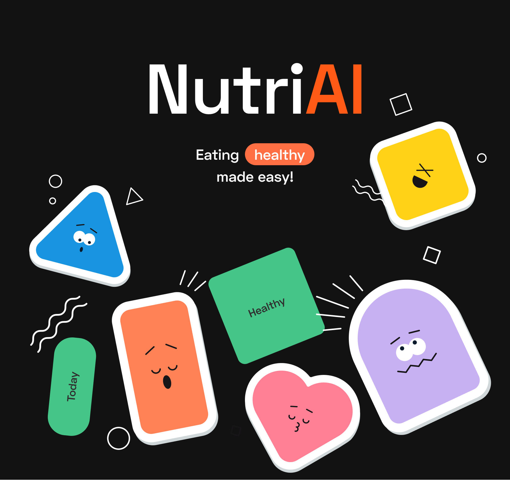

<p align="center">
  
</p>

[](LICENSE)
[](https://nextjs.org/)
[](https://react.dev/)
[](https://www.typescriptlang.org/)

# Nutri AI

> **Nutri AI** is a calorie tracking web application with AI-powered meal parsing. Built with Next.js 15 and Feature-Sliced Design architecture.

This is a **passion-driven pet project** focused on learning modern web development practices and exploring AI integration in everyday applications.

---

## 📑 Table of Contents

- [🔥 Features](#-features)
- [🛠 Tech Stack](#-tech-stack)
- [🚀 Quick Start](#-quick-start)
- [📁 Project Structure](#-project-structure)
- [📜 Available Scripts](#-available-scripts)
- [⚙️ Configuration](#️-configuration)
- [📖 Documentation](#-documentation)
- [🤝 Contributing](#-contributing)
- [📄 License](#-license)

---

## 🔥 Features

### 🤖 AI-Powered Meal Parsing

Enter meals in natural language:

```
"breakfast: oatmeal 50g with banana and honey, coffee with milk"
```

AI transforms it into structured data:

- Recognizes food items
- Determines quantities
- Calculates calories and macronutrients
- Returns confidence level for verification

### 📊 Real-time Sync

- WebSocket connection via Socket.io
- Cross-device data synchronization
- Live statistics updates
- Goal achievement notifications

### 🎨 Modern UI/UX

- Dark/Light theme support
- Responsive design
- Accessible components (Radix UI)
- Smooth animations

---

## 🛠 Tech Stack

| Category         | Technologies                              |
| ---------------- | ----------------------------------------- |
| **Framework**    | Next.js 15.5.6 (Pages Router + Turbopack) |
| **UI Library**   | React 19, React DOM 19                    |
| **Language**     | TypeScript 5                              |
| **Styling**      | Tailwind CSS v4, shadcn/ui                |
| **Server State** | TanStack Query (React Query) 5.90         |
| **Client State** | Zustand 5.0                               |
| **HTTP Client**  | Axios 1.12                                |
| **API Codegen**  | Orval 7.14 (OpenAPI)                      |
| **WebSocket**    | Socket.io Client 4.8                      |
| **Icons**        | Lucide React                              |
| **Testing**      | Vitest, Playwright, Storybook             |
| **API Mocking**  | MSW 2.11                                  |

---

## 🚀 Quick Start

### Prerequisites

- **Node.js** >= 18
- **npm** >= 9

### Installation

```bash
# Clone the repository
git clone https://github.com/your-username/nutri-ai.git
cd nutri-ai

# Install dependencies
npm install

# Create environment file
cp .env.example .env

# Start development server
npm run dev
```

Application will be available at [http://localhost:3000](http://localhost:3000)

---

## 📁 Project Structure

The project follows [Feature-Sliced Design](https://feature-sliced.design/) architecture:

```
├── pages/                  # Next.js routing (thin wrappers only)
│   ├── _app.tsx            # Root component
│   ├── _document.tsx       # HTML document
│   ├── sign-in/            # Public pages
│   └── diary/              # Protected pages
│
└── src/
    ├── app/                # Application infrastructure
    │   ├── pub/            # Public config (layouts)
    │   ├── providers/      # React providers
    │   ├── loaders/        # Data loaders
    │   ├── layouts/        # Layout components
    │   └── interceptors/   # HTTP interceptors
    │
    ├── pages/              # Page business logic
    ├── widgets/            # Composite components
    ├── features/           # Feature modules (theme, i18n, auth)
    ├── entities/           # Business entities
    │
    └── shared/             # Shared infrastructure
        ├── api/            # API client (Orval generated)
        ├── ui/             # UI components
        │   ├── primitives/ # shadcn/ui base components
        │   └── inputs/     # Form-integrated inputs
        ├── lib/            # Utilities and hooks
        └── constants/      # Constants
```

### 📌 Import Rules

- Lower layers **never** import from upper layers
- Use absolute imports via `@/*` alias
- `/pages/` for routing only, logic lives in `/src/pages/`

---

## 📜 Available Scripts

| Command                   | Description                             |
| ------------------------- | --------------------------------------- |
| `npm run dev`             | Start dev server (Turbopack)            |
| `npm run build`           | Production build                        |
| `npm start`               | Start production server                 |
| `npm run lint`            | Run ESLint                              |
| `npm run generate:api`    | Generate API client from OpenAPI schema |
| `npm run storybook`       | Start Storybook on :6006                |
| `npm run build-storybook` | Build static Storybook                  |
| `npm test`                | Run Vitest in watch mode                |
| `npm run test:e2e`        | Run Playwright tests (headless)         |
| `npm run test:e2e:ui`     | Run Playwright with UI                  |

---

## ⚙️ Configuration

### Environment Variables

Create `.env` file based on `.env.example`:

```env
# API
NEXT_PUBLIC_BASE_API_URL=http://localhost:3333

# Google OAuth
NEXT_PUBLIC_GOOGLE_CLIENT_ID=your_google_client_id.apps.googleusercontent.com

# Mock API (for development without backend)
NEXT_PUBLIC_USE_MOCK_API=false
```

### API Generation

After modifying `src/shared/api/schema.yml`:

```bash
npm run generate:api
```

Orval will generate React Query hooks in `src/shared/api/generated/`.

---

## 📖 Documentation

Full documentation is available in the `/docs/` directory:

| Document                                      | Description                |
| --------------------------------------------- | -------------------------- |
| [INDEX.md](./docs/INDEX.md)                   | Documentation navigation   |
| [ARCHITECTURE.md](./docs/ARCHITECTURE.md)     | Architecture details       |
| [API.md](./docs/API.md)                       | API layer documentation    |
| [TESTING.md](./docs/TESTING.md)               | Testing guide              |
| [SPECIFICATIONS.md](./docs/SPECIFICATIONS.md) | Business requirements      |
| [GIT_FLOW.md](./docs/GIT_FLOW.md)             | Git workflow               |

---

## 🤝 Contributing

This is a personal learning project, but suggestions and feedback are welcome!

1. Fork the repository
2. Create your feature branch (`git checkout -b feature/amazing-feature`)
3. Commit your changes (`git commit -m 'Add some amazing feature'`)
4. Push to the branch (`git push origin feature/amazing-feature`)
5. Open a Pull Request

---

## 📄 License

Proprietary Software. All rights reserved.

---

<p align="center">
  Made with ❤️ and ☕
</p>
